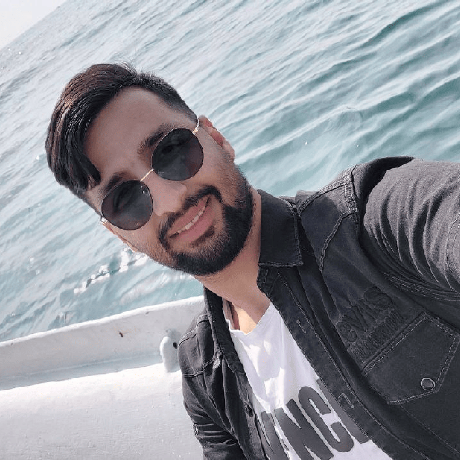

  
  <h2 style="margin: 0;">Mohammad Taslimi</h2>

## About Me

### Education

I am currently a student at [Sharif University of Technology](https://en.sharif.ir/), majoring in **Electrical Engineering**, with a GPA of `18.41 out of 20`. My GPA for the last five semesters is `19.01 out of 20`.

### Research Interests

My primary interests are in machine learning, privacy in machine learning, trustworthy AI, and Large Language Models (LLMs). I am also passionate about computer vision and image processing.

### Working Experience 

I am currently working at **MCILab** as part of the **LLM team**, where we are training a large language model (LLM) for the Persian language. One of our major challenges is data collection, as available data in Persian is quite limited. We are also working on the evaluation of the LLM and aligning it to ensure it does not respond to certain types of questions.

Our LLM can be accessed at [this link](https://llm.mcinext.org/). We offer three models:

1. **Ahoran** – A Persian language model with 8 billion parameters, developed using Meta's Llama 3 and continual pretraining by MCILab. It can answer general knowledge questions.
2. **Sialk** – A Persian language model with 1.3 billion parameters, fully trained by MCILab. It can also answer general knowledge questions.

3. **Ava** – A Persian language model with 13 billion parameters, based on Cohere's Aya model, fine-tuned by MCILab. It is specialized in answering general knowledge and Retrieval-Augmented Generation (RAG) questions.

### Background

I was born in a [small village](https://maps.app.goo.gl/YhUNTv7QLVnVc4VKA) in Iran where there were limited resources, including access to quality schools and [internet](https://shorturl.at/ZfO0h). Despite these challenges, I worked hard to pursue an education. After preparing for an entrance exam, I was accepted into Mofateh High School, which was a significant step forward in my education. Although the transition was difficult at first due to the gap in resources between my previous school and Mofateh, I stayed focused and studied diligently. Over the course of three years, I ranked as the top student each year.

When the time came for the Iranian national university entrance exam, I placed `8th out of 40,000` people in my region and 169th out of 160,000 participants nationwide. As a result, I was able to attend **Sharif University of Technology**, the best university for engineering in Iran, where I began studying Electrical Engineering in 2020.
